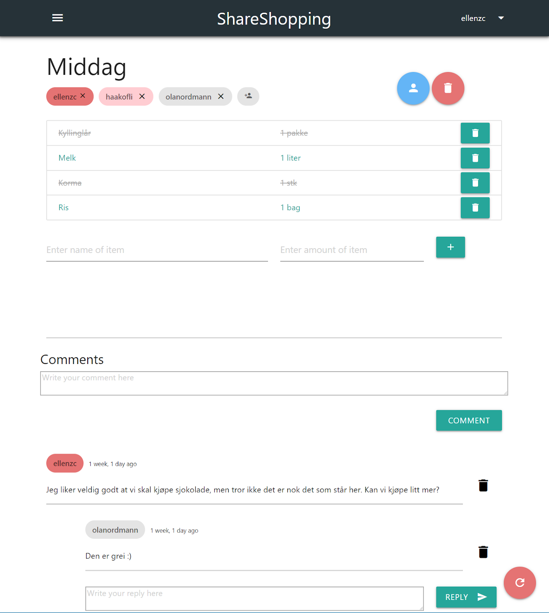
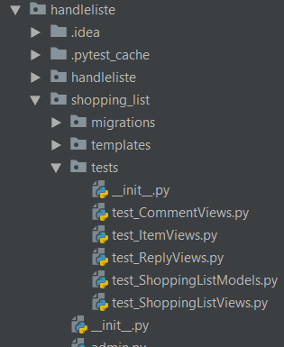
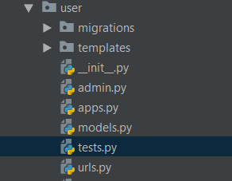
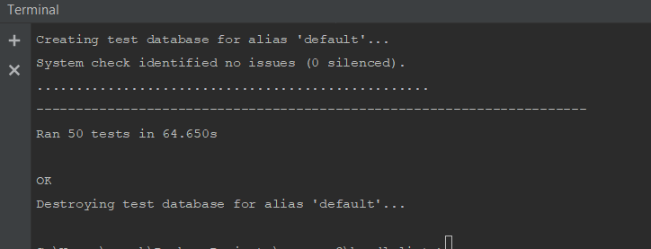

# **ShareShopping**

ShareShopping er en nettside som skal gjøre det enklere å handle i grupper. 
Man kan opprette handlelister, dele lister med andre, kommunisere ved hjelp av et kommentarfelt og legge til/fjerne varer fre lister.

## Motivasjon

"A short description of the motivation behind the creation and maintenance of the project. This should explain why the project exists."

## Build status

## Code style

Vi brukte python sin standard [PEP 8](https://www.python.org/dev/peps/pep-0008/) for koden.  
I tillegg brukte vi Django sine konvensjoner for programmering. Se [her](https://docs.djangoproject.com/en/2.2/internals/contributing/writing-code/coding-style/) for mer info.

## Skjermdump

Eksempel på hvordan nettsiden kan se ut når den er i bruk.

## Teknologi og rammeverk:

Back-end: [Python 3.7.2](https://www.python.org/downloads/release/python-372/). 

Front-end: HTMl, CSS.  

Vi brukte web-rammeverket [Django](https://www.djangoproject.com/) til utvikling av nettsiden. 

Vi brukte [Materialize](https://materializecss.com/) og [SimpleBar](https://grsmto.github.io/simplebar/) som hjelpemiddel i utformingen av brukergrensesnittet.

## For å komme i gang:

1. Last ned Python 3.7.2 fra [https://www.python.org/downloads/](https://www.python.org/downloads/)
2. Last ned package-manageren til python, pip, ved å skrive `curl https://bootst$` og deretter `python get-pip.py`
3. Last ned den riktige versjonen av Django ved å skrive `pip install Django==2.1.5` i kommandolinjen.

## Git:

1. Kjør "git clone https://gitlab.stud.idi.ntnu.no/programvareutvikling-v19/gruppe-3.git" i ønsket mappe.
2. "git init" inne i mappen hvor filene fra prosjektet ligger.
3. Du bør nå ha alle filene og kunne adde, committe, pulle og pushe kode.

## Administrativt:

1. For å logge inn på admin siden bruk:
    > username: superuser   -   password: superuser

## Tilgang til serveren: 

1. Kjør `ssh shareshop@74.207.252.20` i kommandolinjen (i windows må du laste ned PuTTy som lar deg koble deg til servere over internettet på tilsvarende
3. måte. I PuTTy skriver du inn du inn shareshop@74.207.252.20 under *hostname* og trykker *open*. Resten av prosessen er lik for de ulike operativsystemene).
4. Du vil bli spurt om passord (passord: djangoproject). 
5. Du er nå i "home" mappen til serveren. Gå til "share_shopping" mappen og deretter til "handleliste" mappen.
6. Kjør kommandoen `python3 manage.py runserver 0.0.0.0:8000`
7. Django serveren kjører nå på IP-adressen til serveren, som er 74.207.252.20:8000. Kjør dette i nettleseren for å se siden. 

## For enkel start av nettsiden: 

1. Du ha *pxssh* installert hvis du er på linux eller mac, og *paramiko* hvis du er på windows. Installasjon gjøres enkelt ved å skrive inn `pip install pxssh` i kommandolinjen.
   Bytt ut pxssh med paramiko hvis du er på windows. 
2. Last ned og kjør auto_start_linux.py, auto_start_mac.py eller auto_start_windows.py, avhengig av hvilket operativsystem du bruker.
3. Vent noen sekunder. Nettleseren din vil åpne programmet for deg. 

## Testing

##### Unit testing i Django ved utvikling:

Tester for views.py finnes under shopping_list > tests:

Tester for users finnes under user > tests.py:

Django vil automatisk se på alle metoder med navn test_XXX som tester.  
For å kjøre testene, går man i terminalen, bytter directory til mappen med prosjektet, og kjører  
"python manage.py test". Etter litt tid vil du få igjen noe som dette:

## Credits

#### Utviklere
* [Håkon Fuhre Lia](https://gitlab.stud.idi.ntnu.no/haakofli)
* [Ellen Zhang Chang](https://gitlab.stud.idi.ntnu.no/ellenzc)
* [Mads Engja Rindal](https://gitlab.stud.idi.ntnu.no/madseri)
* [Amer Kalac](https://gitlab.stud.idi.ntnu.no/amerk)
* [Damir Medakovic](https://gitlab.stud.idi.ntnu.no/damirm)
* [Silje Leidland](https://gitlab.stud.idi.ntnu.no/siljelei)

#### Produkteier
* [Jonas Jevnaker Aas](https://gitlab.stud.idi.ntnu.no/jonasjaa)

#### Veileder
* [Erik Stensrud Larsen](https://gitlab.stud.idi.ntnu.no/eriksla)

