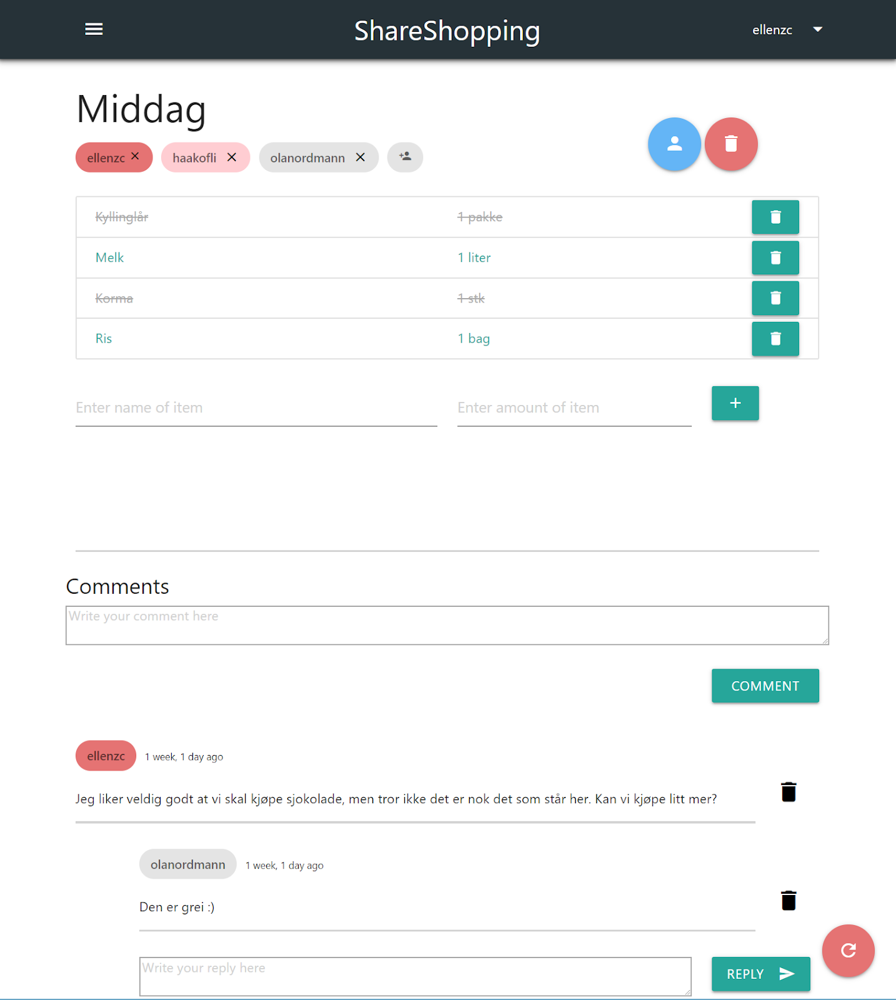

# **ShareShopping**

ShareShopping er en nettside som skal gjøre det enklere å handle i grupper. 
Man kan opprette handlelister, dele lister med andre, kommunisere ved hjelp av et kommentarfelt og legge til/fjerne varer fre lister.

## Build status

## Code style

Vi brukte Django sine konvensjoner for programmering (PEP8). Se [her](https://docs.djangoproject.com/en/2.2/internals/contributing/writing-code/coding-style/) for mer info.

## Skjermdump

Eksempel på hvordan nettsiden kan se ut når den er i bruk.

## Teknologi/rammeverk brukt:

Som rammeverk for utvikling av nettsiden brukte vi [Django](https://www.djangoproject.com/). 
Vi brukte [Materialize](https://materializecss.com/) og [SimpleBar](https://grsmto.github.io/simplebar/) som hjelpemiddel i utformingen av brukergrensesnittet.

## For å komme i gang:

1. Last ned Python 3.7.2 fra [https://www.python.org/downloads/](https://www.python.org/downloads/)
2. Sjekk at den fungerer ved å skrive "python" i kommandolinjen.
3. Last ned package-manageren til python, pip, ved å skrive `curl https://bootst$` og deretter `python get-pip.py`
4. Last ned den nyeste ofisielle versjonen av Django ved å skrive `pip install Django==2.1.5` i kommandolinjen.

## Git:

1. Åpne kommandolinjen og naviger til hvor du vil ha filene.
2. "git clone https://gitlab.stud.idi.ntnu.no/programvareutvikling-v19/gruppe-3.$
3. "git init" inne i mappen hvor filene fra prosjektet ligger.
4. Du bør nå ha alle filene og kunne adde, committe, pulle og pushe kode.

## Administrativt:

1. For å logge inn på admin siden bruk:
    > username: superuser   -   password: superuser
2. Sjekk at den fungerer ved å skrive "python" i kommandolinjen.  
3. Last ned package-manageren til python, pip, ved å skrive `curl https://bootstrap.pypa.io/get-pip.py -o get-pip.py`
  og deretter `python get-pip.py` 
4. Last ned den nyeste ofisielle versjonen av Django ved å skrive 
    `pip install Django==2.1.5` i kommandolinjen. 

## Tilgang til serveren: 

1. Åpne et nytt terminalvindu.
2. Tast inn `ssh dmedakovic@74.207.252.20` (i windows må du laste ned PuTTy som lar deg koble deg til servere over internettet på tilsvarende
3. måte. I PuTTy skriver du inn du inn dmedakovic@74.207.252.20 under *hostname* og trykker *open*. Resten av prosessen bør være lik).
4. Du vil bli spurt om passord (passord: medakovic). 
5. Du er nå i "home" mappen til serveren. Gå til "gruppe-3" mappen og deretter til "handleliste" mappen ved å bruke cd og dir/ls kommandoene. 
6. Kjør kommandoen `python3 manage.py runserver 0.0.0.0:8000`
7. Django serveren kjører nå på IP-adressen til serveren, som er 74.207.252.20:8000.

## Kjøre serveren: 

1. Kjør filen auto_start.py og vent noen sekunder mens programmet logger inn gjennom ssh og starter serveren. 
2. Åpne nettleseren og gå til 74.207.252.20:8000.

## Credits

#### Utviklere
* [Håkon Fuhre Lia](https://gitlab.stud.idi.ntnu.no/haakofli)
* [Ellen Zhang Chang](https://gitlab.stud.idi.ntnu.no/ellenzc)
* [Mads Engja Rindal](https://gitlab.stud.idi.ntnu.no/madseri)
* [Amer Kalac](https://gitlab.stud.idi.ntnu.no/amerk)
* [Damir Medakovic](https://gitlab.stud.idi.ntnu.no/damirm)
* [Silje Leidland](https://gitlab.stud.idi.ntnu.no/siljelei)

#### Produkteier
* [Jonas Jevnaker Aas](https://gitlab.stud.idi.ntnu.no/jonasjaa)

#### Veileder
* [Erik Stensrud Larsen](https://gitlab.stud.idi.ntnu.no/eriksla)

