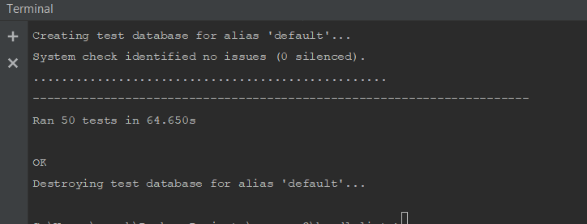
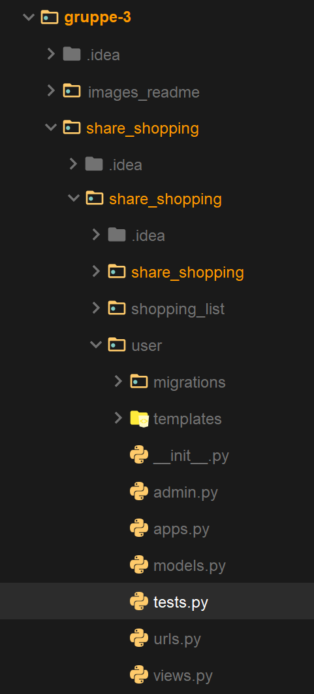

# **ShareShopping**

ShareShopping er en nettside som gjør det enklere å handle i grupper. 
Man kan opprette handlelister, dele handlelister med andre, kommunisere ved hjelp av et kommentarfelt og legge til/fjerne varer fra handlelister.

## Motivation
Prosjektet ble laget fordi det var ønsket å gjøre det enklere å handle selvstendig uten komplikasjoner for andre man samarbeider med.

## Build status

## Code style

Vi brukte [Django sine konvensjoner for programmering](https://docs.djangoproject.com/en/2.2/internals/contributing/writing-code/coding-style/).
Vi brukte også Pythons kodestandard [PEP 8](https://www.python.org/dev/peps/pep-0008/).  

## Screenshots

Eksempel på hvordan nettsiden kan se ut når den er i bruk.

## Technology and framework

Back-end: [Python 3.7.2](https://www.python.org/downloads/release/python-372/), SQLite.  
Front-end: HTML, CSS.  

Vi brukte rammeverket [Django](https://www.djangoproject.com/) til utvikling av nettsiden. 
Vi brukte [Materialize](https://materializecss.com/) og [SimpleBar](https://grsmto.github.io/simplebar/) til utformingen av brukergrensesnittet.

## Requirements
- Python 3.7.2

## Installation
Det kreves ikke installasjon for å bruke produktet med mindre serveren ikke kjører. Gå inn på nettsiden ved å trykke [her](http://74.207.252.20:8000/).  
For å starte serveren gjør følgende:
1. Du må ha *pxssh* installert hvis du er på linux eller mac, og *paramiko* hvis du er på windows. Åpne kommandolinjen til operativsystemet ditt (f.eks. cmd på windows). Installasjon gjøres enkelt ved å skrive inn `pip install pxssh` i kommandolinjen.
   Bytt ut *pxssh* med *paramiko* hvis du er på windows. Dersom du aldri har brukt pip før, se [her](https://pypi.org/project/pip/).
2. Last ned og kjør `auto_start_linux.py`, `auto_start_mac.py` eller `auto_start_windows.py`, avhengig av hvilket operativsystem du bruker.
3. Vent noen sekunder. Nettleseren din vil åpne programmet for deg.

Dersom dette ikke fungerte, se [Manuel oppstart av server](https://gitlab.stud.idi.ntnu.no/programvareutvikling-v19/gruppe-3#manuel-oppstart-av-server)

## How to use
For å lære om hvordan bruke produktet, se [brukermanualen](https://gitlab.stud.idi.ntnu.no/programvareutvikling-v19/gruppe-3/wikis/Brukermanual).

## Testing
Vi skrev unit-tester med Pythons unit-testing rammeverk, [unittest](https://docs.python.org/3/library/unittest.html).
For å kjøre unit-testene brukes standard metode for Django-testing.  
Django vil automatisk se på alle metoder med navn test_XXX som tester.  
For å kjøre testene må man bruke terminalen til å navigere til `share_shopping`-mappen som inneholder `manage.py`-filen. Skriv deretter
`python manage.py test` i terminalen. Etter litt tid vil du få igjen noe som dette:

Testene finnes under `gruppe-3/share_shopping/shopping_list` og `gruppe-3/share_shopping/user`

## Starting the server manually
Du må først logge inn til serveren:

1. Kjør `ssh shareshop@74.207.252.20` i kommandolinjen. I windows kreves PuTTy for å bruke ssh-protokoll.
2. I PuTTy skriver du inn du inn shareshop@74.207.252.20 under *hostname* og trykker *open*. Resten av prosessen er lik for de ulike operativsystemene).
3. Når du blir spurt om passord, tast inn `djangoproject`.
4. Nå er du inne på serveren. 

For å kjøre prosjektet og nettsiden:

1. Gå til `share_shopping/share_shopping` mappen.
2. Kjør kommandoen `python3 manage.py runserver 0.0.0.0:8000`
3. Django serveren kjører nå på IP-adressen til serveren, som er 74.207.252.20:8000. Kjør dette i nettleseren for å se siden. 

## Features
- Brukere kan lage, endre og dele handlelister
- Brukere kan forlate og slette handlelister
- Handlelister har eier, admin og deltaker-roller med ulike rettigheter
- Handlelister har kommentarfelt

## Contributing
Vi tar imot forslag og krav til produktet på e-post: tips@shareshopping.com  
Vi tar gjerne imot hjelp og forslag fra andre utviklere. Vi følger "fork-and-pull" Git arbeidsflyt.
1. **Fork** repositorien på GitLab
2. **Clone** prosjektet til din egen maskin
3. **Commit** endringer til din egen branch
4. **Push** ditt arbeid til din fork
5. Lag en **Pull request** slik at vi kan vurdere dine endringer

## Credits

#### Utviklere
* [Håkon Fuhre Lia](https://gitlab.stud.idi.ntnu.no/haakofli)
* [Ellen Zhang Chang](https://gitlab.stud.idi.ntnu.no/ellenzc)
* [Mads Engja Rindal](https://gitlab.stud.idi.ntnu.no/madseri)
* [Amer Kalac](https://gitlab.stud.idi.ntnu.no/amerk)
* [Damir Medakovic](https://gitlab.stud.idi.ntnu.no/damirm)
* [Silje Leidland](https://gitlab.stud.idi.ntnu.no/siljelei)

#### Produkteier
* [Jonas Jevnaker Aas](https://gitlab.stud.idi.ntnu.no/jonasjaa)

#### Veileder
* [Erik Stensrud Larsen](https://gitlab.stud.idi.ntnu.no/eriksla)

